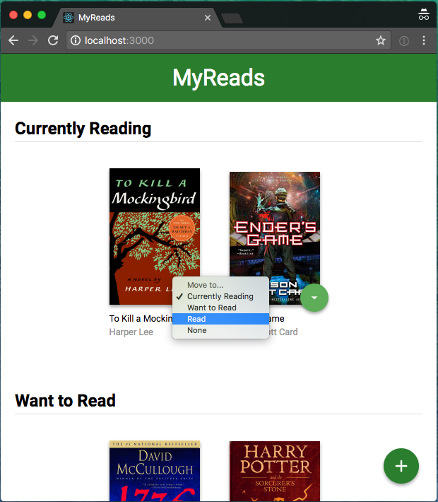
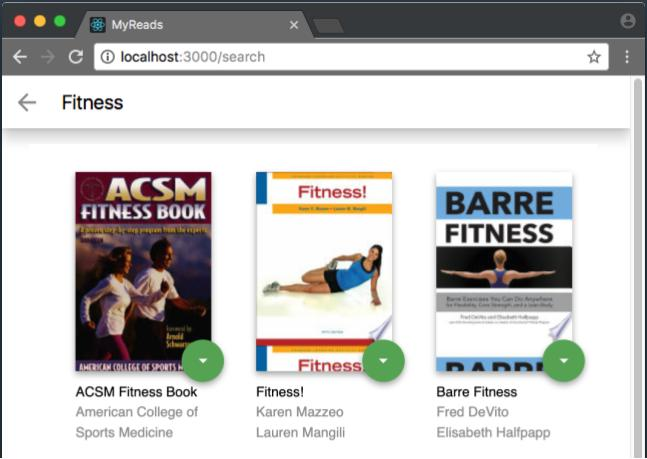

# MyReads

A bookshelf app that allows you to select and categorize books you have read, are currently reading, or want to read.

## Installation

Use the package manager [npm](https://www.npmjs.com) to install node_modules. This app builds with Node 14 so please install with Node 14 to avoid errors.

```bash
npm install
```

## Usage

Run this command to run the app locally.

```bash
npm start
```

## Features

There are three shelves:

- Currently Reading
- Want to Read
- Read

Each book has a button which allows you to move to the book to your desired shelf. You can also click the plus button on the bottom right corner of the main page to move to search page. (See image below).



The search page has a text field for you to find books which have titles matched with the keyword. You can also move books to your desired shelves. (See image below).



You can navigate to the main page from the search page and all changes you made on the search page will be reflected on the main page without refreshing.

## Project structure

```bash
├── README.md # This file.
├── package.json # npm package manager file. No need modify this file.
├── package-lock.json # A file created by npm after running `npm install`.
├── jsconfig.json # Specifies the root files.
├── image.png # An example of the app features used in README.md file.
├── image-1.png # An example of the app features used in README.md file.
├── .gitignore # Specifies which files to exclude from commit.
├── public
│   ├── favicon.ico # The logo of the tab on web browser. You may change if you wish.
│   ├── index.html # The mounting point for React app. DO NOT MODIFY.
│   ├── logo192.png # The logo of the app.
│   ├── logo512.png # The logo of the app.
│   ├── manifest.json # The web app manifest which provides information about the application.
│   └── robots.txt # Prevents search engines and bots to crawl up the sites.
├── src
│   └── components
│       └── book
│           ├── Book.js # Component for book.
│           ├── BookCover.js # Component for book's cover.
│           └── BookShelf.js # Component for shelf.
│       └── pages
│           ├── HomePage.js # Component for home page.
│           └── SearchPage.js # Component for search page.
│       ├── App.js # The root of the app which contains home page and search page.
│       └── ChangeShelfButton.js # Component for the button used to change book's shelf.
│   └── constants
│       └── constants.js # Constants used in app.
│   └── context
│       └── ShelvesContext.js # Context used for shelves.
│   └── css
│       ├── App.css # Style for the app.
│       ├── Book.css # Style for the book.
│       ├── BookCover.css # Style for the book's cover.
│       ├── BookShelf.css # Style for the shelf.
│       ├── ChangeShelfButton.css # Style for the button to change book's shelf.
│       ├── HomePage.css # Style for the main page.
│       ├── index.css # Global style. No need to modify this file.
│       └── SearchPage.css # Style for the search page.
│   └── icons
│       ├── add.svg # Plus icon.
│       ├── arrow-back.svg # Back icon.
└───    └── arrow-drop-down.svg # Icon for change book's shelf button.
    ├── BooksAPI.js # Provides methods to call Udacity API. No need to modify this file.
    └── index.js # Used for DOM rendering. No need to modify this file.
```

## License

This is a Udacity project. Please **DO NOT COPY OR DISTRIBUTE** it under any circumstances.
